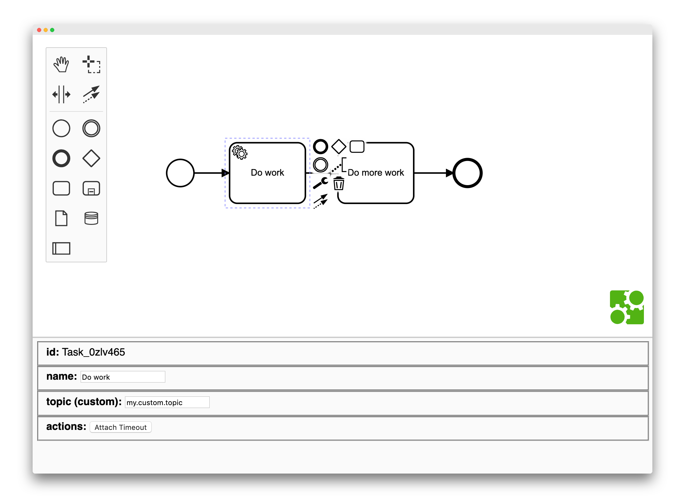

# React Properties Panel for bpmn-js

This example demonstrates a custom properties panel for [bpmn-js](https://github.com/bpmn-io/bpmn-js) written in [React](https://reactjs.org/).



## 关于

这个组件 [`PropertiesView`](https://github.com/bpmn-io/bpmn-js-example-react-properties-panel/blob/master/app/properties-panel/PropertiesView.js) 实现了属性面板.

这个组件已经通过标准的 React 工具加载，并且接收 BPMN modeler 实例作为 props：

```js
ReactDOM.render(<PropertiesView modeler={modeler} />, container);
```

作为其生命周期钩子的一部分，它与 bpmn-js change 和 selection 事件挂钩，以对编辑器更改做出响应：

```js
class PropertiesView extends React.Component {

  ...

  componentDidMount() {

    const {
       modeler
    } = this.props;

    modeler.on('selection.changed', (e) => {
      this.setElement(e.newSelection[0]);
    });

    modeler.on('element.changed', (e) => {
      this.setElement(e.element);
    });
  }

}
```

渲染组件，我们可以展示 element 的属性并且进行修改：

```js
class PropertiesView extends React.Component {

  ...

  render() {

    const {
      element
    } = this.state;

    return (
      <div>
        <fieldset>
          <label>id</label>
          <span>{ element.id }</span>
        </fieldset>

        <fieldset>
          <label>name</label>
          <input value={ element.businessObject.name || '' } onChange={ (event) => {
            this.updateName(event.target.value);
          } } />
        </fieldset>
      </div>
    );
  }

  updateName(newName) {

    const {
      element
    } = this.state;

    const {
      modeler
    } = this.props;

    const modeling = modeler.get('modeling');

    modeling.updateLabel(element, newName);
  }
}
```

## Run the Example

```sh
npm install
npm start
```

## License

MIT
